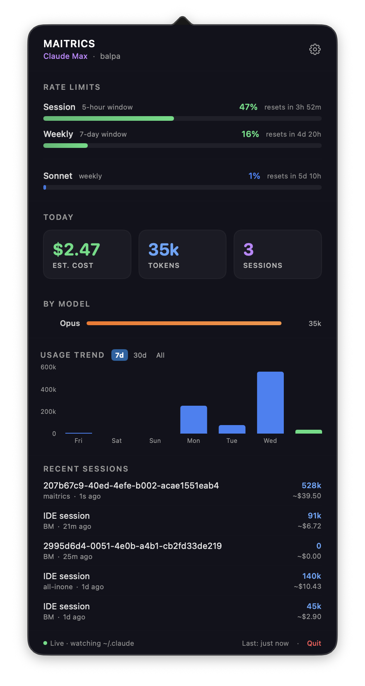

# Maitrics

A native macOS menu bar app that displays your [Claude Code](https://docs.anthropic.com/en/docs/claude-code) CLI usage data in a modern dark dashboard.



## Features

- **Menu bar status widget** — Stacked gradient bars showing session and weekly usage at a glance
- **Rate limits** — Real-time session (5h) and weekly (7d) usage with reset timers, per-model quotas
- **Today's summary** — Estimated cost, token count, and session count
- **Model breakdown** — Token usage split by model family (Opus, Sonnet, Haiku)
- **Usage trend chart** — Interactive bar chart with 7-day, 30-day, and all-time views with hover tooltips
- **Recent sessions** — Last 5 sessions with prompts, project names, branches, token counts, and costs
- **Inline settings** — Connection status, icon thresholds, model pricing, launch at login
- **Auto-updating pricing** — Model pricing fetched automatically from upstream
- **Live file watching** — Monitors `~/.claude/` for real-time updates

## Screenshots

### Menu Bar


The status bar shows two gradient bars: **S** (session, 5-hour window) and **W** (weekly, 7-day window). Bar colors shift from green to yellow to red as usage increases.

### Dashboard


## Requirements

- macOS 14.0 (Sonoma) or later
- [Claude Code CLI](https://docs.anthropic.com/en/docs/claude-code) installed and logged in

## Install

Download the latest `Maitrics.dmg` from [Releases](https://github.com/balpa/maitrics/releases), open it, and drag Maitrics to Applications.

## Build from Source

```bash
# Clone
git clone https://github.com/balpa/maitrics.git
cd maitrics

# Build and run (debug)
swift build
Scripts/build-app.sh
open dist/Maitrics.app

# Build release DMG
Scripts/create-dmg.sh
```

## How It Works

Maitrics reads data from two sources:

1. **Local files** — Parses `~/.claude/stats-cache.json` for historical usage and scans `~/.claude/projects/` for session JSONL files to compute live daily tokens
2. **Anthropic OAuth API** — Fetches real-time rate limit usage and profile data using the token stored by Claude Code CLI

No additional login is required. Maitrics uses the same authentication that Claude Code CLI sets up.

## Architecture

- **Swift Package Manager** with two targets: `MaitricsCore` (testable library) and `Maitrics` (executable)
- **SwiftUI** views hosted in an `NSPopover` attached to `NSStatusItem`
- **Swift Charts** for the usage trend chart
- **`@Observable`** data manager with `DispatchSource` file watcher for live updates

## License

Copyright 2026 balpa. All rights reserved.
